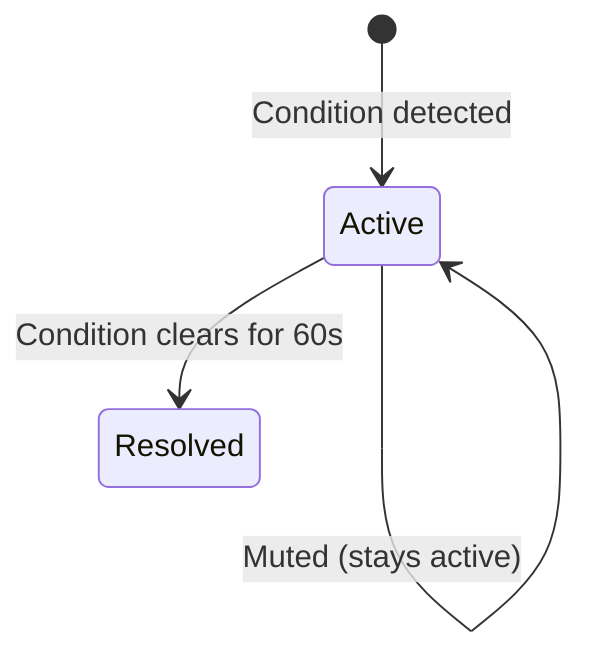

# Alerts

An **alert** is a notification that something needs attention — a threshold has been crossed, a service has stopped, or a node has gone offline. Alerts are created automatically by the [alert evaluator](./alert-configurations.md) and flow through the escalation system to notify the right people.

---

## Alert Lifecycle

Every alert moves through a simple two-state lifecycle:

| State | Meaning |
|-------|---------|
| **Active** | The condition is currently occurring — the alert is visible and may be generating notifications |
| **Resolved** | The condition has cleared and the alert is closed |

:::info
Previous alert states like "acknowledged" and "muted" are now **metadata flags** on active alerts, not separate states. An alert can be active, acknowledged, and muted simultaneously.
:::

---

## Alert Types

| Type | Trigger |
|------|---------|
| **Threshold Exceeded** | A metric crosses a warning or critical threshold defined in an [alert configuration](./alert-configurations.md) |
| **Service Stopped** | A monitored Windows or Linux service has stopped running |
| **Node Unreachable** | No ping response or SNMP data received for 3 consecutive checks (30 seconds) |
| **Agent Heartbeat** | An agent has not checked in for 5+ minutes |
| **Interface Alert** | A monitored network interface has gone down |

---

## Severity

| Severity | Meaning |
|----------|---------|
| **Warning** | A metric has crossed the warning threshold — investigate soon |
| **Critical** | A metric has crossed the critical threshold — immediate attention needed |

Severity can **escalate** during an alert's lifetime. If a metric crosses the warning threshold and then continues rising past the critical threshold, the existing alert's severity is upgraded from warning to critical without creating a duplicate.

---

## Evaluation Cycle

The alert evaluator runs every **10 seconds**. Each cycle:

1. Checks all enabled [alert configurations](./alert-configurations.md) against current metric data
2. **New condition detected** — creates an alert with the appropriate severity
3. **Existing alert, condition persists** — no action (alert stays active)
4. **Existing alert, severity changed** — updates the alert's severity
5. **Existing alert, condition cleared** — waits for the 60-second grace period, then resolves
6. **Node health updated** — recalculates and updates the health status on any node whose alerts changed

### Deduplication

Each alert has a unique **alert key** that prevents duplicates. Only one active alert can exist per node for a given alert key. If the evaluator detects the same condition that already has an active alert, it skips creation.

Alert key examples:
- `service:DHCPServer` — the DHCP service on a specific node
- `cpu_usage_percent` — CPU threshold on a specific node
- `disk_usage_percent:C:` — disk space on a specific volume

---

## Alert Grouping

Related alerts are grouped into **incidents** using a condition group. When multiple alert configurations fire for the same underlying condition on a node (e.g., both a built-in and a custom CPU threshold), they share the same group ID.

The grouped alerts view in **Alerting → Alerts** collapses these into a single incident row, showing:
- The condition type (e.g., "High CPU Usage")
- All associated alert configurations
- The highest severity in the group
- The linked escalation team

---

## Acknowledgment

Acknowledging an alert signals that someone is aware of the issue and working on it. Acknowledgment is a metadata flag — it does **not** resolve or silence the alert.

To acknowledge an alert:
1. Open **Alerting → Alerts**
2. Click on the alert or alert group
3. Click **Acknowledge** and optionally add a comment

You can also bulk-acknowledge all alerts in a condition group at once.

Acknowledged alerts:
- Remain **active** until the condition clears
- Still show in the alerts list (with an "acknowledged" badge)
- Continue to show on node health status
- Trigger acknowledgment notifications to the escalation team (if configured)

---

## Muting

Muting an alert suppresses its notifications without resolving it. This is useful when you're aware of an issue but don't want repeated notifications while you work on it.

Mute an individual alert with a duration:
- **30 minutes**, **1 hour**, **6 hours**, **24 hours**, or **Until resolved**

Muted alerts:
- Remain **active** and visible in the UI
- Are skipped by the [escalation engine](./escalation-teams.md) — no notifications sent
- Automatically unmute when the duration expires (or when the alert resolves)

:::tip
For broader suppression — silencing all alerts on a node, site, or group during planned work — use [maintenance windows](./maintenance.md) instead of per-alert muting.
:::

---

## Node Health Status

The alert evaluator determines each node's health status based on its active alerts. The highest-severity condition wins:

| Active Alerts | Node Health Status |
|---------------|-------------------|
| Any reachability alert (unreachable or heartbeat) | **Offline** |
| Any critical alert (no reachability issue) | **Critical** |
| Any warning alert (no critical or reachability) | **Warning** |
| No active alerts, node is reachable | **Healthy** |

Reachability takes precedence because metrics can't be meaningfully evaluated on an unreachable node.

See [Nodes — Health Status](../infrastructure/nodes.md#health-status) for the full status list including Discovering and Maintenance.

---

## Alert Summary

The dashboard HUD displays a real-time summary of the alert landscape:

- **Critical alerts** — count of active critical-severity alerts
- **Warning alerts** — count of active warning-severity alerts
- **Offline nodes** — nodes with active reachability alerts
- **Maintenance nodes** — nodes currently in a maintenance window
- **Healthy nodes** — nodes with no active alerts

The alert count also breaks down into acknowledged and muted counts for quick triage.
