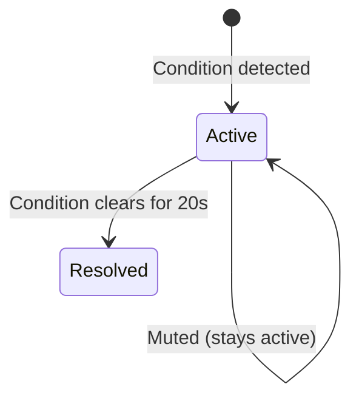

# Alerts

An **alert** is a notification that something needs attention — a threshold has been crossed, a service has stopped, or a node has gone offline. Alerts are created automatically by the [alert evaluator](./alert-configurations.md) and flow through the escalation system to notify the right people.

---

## Alert Lifecycle

Every alert moves through a simple two-state lifecycle:

```mermaid
stateDiagram-v2
    [*] --> Active: Condition detected
    Active --> Active: Severity escalates (warning → critical)
    Active --> Resolved: Condition clears for 20s
    Active --> Active: Acknowledged (stays active)
    Active --> Active: Muted (stays active)
```

| State | Meaning |
|-------|---------|
| **Active** | The condition is currently occurring — the alert is visible and may be generating notifications |
| **Resolved** | The condition has cleared and the alert is closed |

:::info
Previous alert states like "acknowledged" and "muted" are now **metadata flags** on active alerts, not separate states. An alert can be active, acknowledged, and muted simultaneously.
:::

---

## Alert Types

| Type | Trigger |
|------|---------|
| **Threshold Exceeded** | A metric crosses a warning or critical threshold defined in an [alert configuration](./alert-configurations.md) |
| **Service Stopped** | A monitored Windows or Linux service has stopped running |
| **Node Unreachable** | No ping response received — a single 100% packet loss sample triggers detection |
| **Agent Heartbeat** | An agent has not checked in within 30 seconds (3 missed heartbeats) |
| **Interface Alert** | A monitored network interface has gone down |

---

## Severity

| Severity | Meaning |
|----------|---------|
| **Warning** | A metric has crossed the warning threshold — investigate soon |
| **Critical** | A metric has crossed the critical threshold — immediate attention needed |

Severity can **escalate** during an alert's lifetime. If a metric crosses the warning threshold and then continues rising past the critical threshold, the existing alert's severity is upgraded from warning to critical without creating a duplicate.

---

## Evaluation Cycle

The alert evaluator runs every **10 seconds**. Each cycle:

1. Checks all enabled [alert configurations](./alert-configurations.md) against current metric data
2. **New condition detected** — creates an alert with the appropriate severity
3. **Existing alert, condition persists** — no action (alert stays active)
4. **Existing alert, severity changed** — updates the alert's severity
5. **Existing alert, condition cleared** — waits for the 20-second grace period, then resolves
6. **Node health updated** — recalculates and updates the health status on any node whose alerts changed

### Deduplication

Each alert has a unique **alert key** that prevents duplicates. Only one active alert can exist per node for a given alert key. If the evaluator detects the same condition that already has an active alert, it skips creation.

Alert key examples:
- `service:DHCPServer` — the DHCP service on a specific node
- `cpu_usage_percent` — CPU threshold on a specific node
- `disk_usage_percent:C:` — disk space on a specific volume

---

## Alert Lifecycle Timing

This section documents the expected detection and recovery latencies for Stratora alerts.

### Timing Summary

| Alert Type | Detection | Recovery (Stratora) | Recovery (Total) |
|------------|-----------|---------------------|------------------|
| Node Unreachable | 20–30s | ~40s after node is reachable | 45–100s depending on boot speed |
| High Packet Loss | ~60s of sustained loss | ~80s after loss returns to 0% | ~80–110s |
| Agent Heartbeat | 30s (3 missed heartbeats) | Immediate on next heartbeat | ~10s |
| Service Stopped | 10–20s | 10–20s after service restarts | 10–20s |

### Node Unreachable — Detection

Typical detection latency is **20–30 seconds** from the moment a node becomes unreachable.

The ping fast-path evaluates every 10 seconds. Each sample sends 3 ICMP packets to the target node. A single evaluation cycle showing 100% packet loss triggers detection immediately — no streak or consecutive-failure requirement.

The 20–30s range comes from timing alignment: the worst case is a node going down immediately after an evaluation cycle completes, requiring a full 10s wait for the next cycle, plus up to 10s for Telegraf to collect and flush the ping data.

Graceful shutdowns (OS-initiated) may respond to some ICMP packets during the shutdown sequence, adding a few seconds compared to hard failures like power loss or NIC disconnection.

### Node Unreachable — Recovery

After a node becomes genuinely reachable again, Stratora's contribution to recovery latency is approximately **40 seconds**:

- **~30 seconds** — recovery streak: 3 consecutive ping evaluation cycles must show less than 100% packet loss. This prevents false resolutions from brief network blips or intermittent partial responses on a node that is still offline.
- **~10 seconds** — one additional evaluation cycle for hysteresis confirmation

Unlike other alert types, node reachability alerts do not use an additional grace period — the recovery streak itself provides the stability window. This keeps recovery as fast as possible while still preventing alert flapping.

If a node is intentionally offline (powered down, decommissioned, or under maintenance), you can [mute the node](/alerting/maintenance) to suppress ongoing alerts and notifications.

**Total recovery time** depends on the node's boot speed:

| Scenario | Typical Total Recovery |
|----------|----------------------|
| Physical server or fast-boot VM | 45–55s |
| Standard VM (full OS + network stack init) | 60–100s |
| Slow boot (disk checks, large service inventory) | 90–120s |

### High Packet Loss (Threshold Alert)

The "High Packet Loss" alert uses a **60-second rolling average** (`avg_over_time`) to evaluate packet loss against configured thresholds (default: 5% warning, 20% critical).

**Detection:** Fires after ~60 seconds of sustained packet loss above the threshold. The rolling average smooths out transient single-sample spikes.

**Recovery:** After packet loss returns to 0%, the 60-second window must decay (old high-loss samples age out), then the 20-second grace period must elapse. Expect **80–110 seconds** from loss recovery to alert resolution.

This alert is a secondary signal. The **Node Unreachable** alert (20–30s detection) is the primary fast-path indicator for complete connectivity loss. The packet loss alert covers partial degradation scenarios where the node is still partially reachable.

### Ping Sample Methodology

Stratora pings each monitored node with **3 ICMP packets every 10 seconds**. Packet loss per sample is reported as 0%, 33.3%, 66.7%, or 100%. A single dropped packet out of three registers as 33.3% loss, not a binary up/down determination. This design prevents false positives from transient single-packet drops that are common on congested networks, while still detecting genuine connectivity issues within a single evaluation cycle.

---

## Alert Grouping

Related alerts are grouped into **incidents** using a condition group. When multiple alert configurations fire for the same underlying condition on a node (e.g., both a built-in and a custom CPU threshold), they share the same group ID.

The grouped alerts view in **Alerting → Alerts** collapses these into a single incident row, showing:
- The condition type (e.g., "High CPU Usage")
- All associated alert configurations
- The highest severity in the group
- The linked escalation team

---

## Acknowledgment

Acknowledging an alert signals that someone is aware of the issue and working on it. Acknowledgment is a metadata flag — it does **not** resolve or silence the alert.

To acknowledge an alert:
1. Open **Alerting → Alerts**
2. Click on the alert or alert group
3. Click **Acknowledge** and optionally add a comment

You can also bulk-acknowledge all alerts in a condition group at once.

Acknowledged alerts:
- Remain **active** until the condition clears
- Still show in the alerts list (with an "acknowledged" badge)
- Continue to show on node health status
- Trigger acknowledgment notifications to the escalation team (if configured)

---

## Muting

Muting an alert suppresses its notifications without resolving it. This is useful when you're aware of an issue but don't want repeated notifications while you work on it.

Mute an individual alert with a duration:
- **30 minutes**, **1 hour**, **6 hours**, **24 hours**, or **Until resolved**

Muted alerts:
- Remain **active** and visible in the UI
- Are skipped by the [escalation engine](./escalation-teams.md) — no notifications sent
- Automatically unmute when the duration expires (or when the alert resolves)

:::tip
For broader suppression — silencing all alerts on a node, site, or group during planned work — use [maintenance windows](./maintenance.md) instead of per-alert muting.
:::

---

## Node Health Status

The alert evaluator determines each node's health status based on its active alerts. The highest-severity condition wins:

| Active Alerts | Node Health Status |
|---------------|-------------------|
| Any reachability alert (unreachable or heartbeat) | **Offline** |
| Any critical alert (no reachability issue) | **Critical** |
| Any warning alert (no critical or reachability) | **Warning** |
| No active alerts, node is reachable | **Healthy** |

Reachability takes precedence because metrics can't be meaningfully evaluated on an unreachable node.

See [Nodes — Health Status](../infrastructure/nodes.md#health-status) for the full status list including Discovering and Maintenance.

---

## Alert Summary

The dashboard HUD displays a real-time summary of the alert landscape:

- **Critical alerts** — count of active critical-severity alerts
- **Warning alerts** — count of active warning-severity alerts
- **Offline nodes** — nodes with active reachability alerts
- **Maintenance nodes** — nodes currently in a maintenance window
- **Healthy nodes** — nodes with no active alerts

The alert count also breaks down into acknowledged and muted counts for quick triage.
