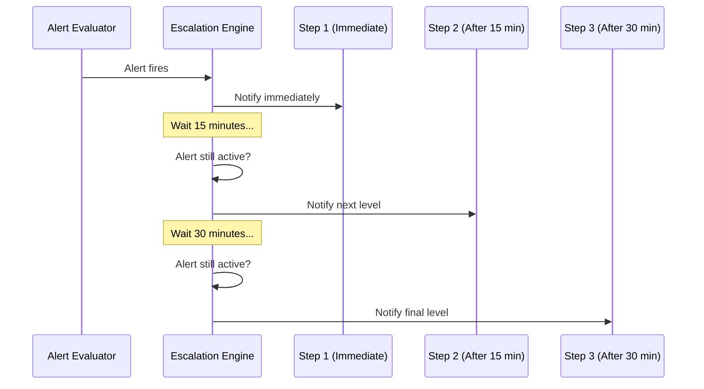

# Escalation Teams

An **escalation team** defines who gets notified when an alert fires and how notifications escalate if the alert isn't resolved. Each team has one or more steps, each with its own delay and notification channels.

---

## How Escalation Works

1. An [alert configuration](./alert-configurations.md) fires and creates an alert
2. The escalation engine picks up the alert and starts at **Step 1**
3. If the alert is still active after the delay defined on the next step, notifications advance to **Step 2**
4. This continues through all defined steps
5. If **repeat** is enabled, the cycle starts over from Step 1

The escalation engine runs on a **10-second cycle**, checking for alerts that need escalation.

---

## Creating an Escalation Team

Navigate to **Alerting → Escalation Teams** and click **Add Team**.

### Team Fields

| Field | Required | Description |
|-------|----------|-------------|
| Name | Yes | Display name for the team (e.g., "Network Operations", "After-Hours On-Call") |
| Description | No | Notes about the team's purpose |
| Enabled | Yes | Whether the team is active (default: yes) |
| Schedule Type | Yes | When the team is active — see [Schedules](#schedules) |
| Repeat Enabled | No | Whether to loop back to Step 1 after all steps complete |
| Repeat Interval | No | Minutes between repeat cycles (if repeat is enabled) |
| Max Repeats | No | Maximum number of repeat cycles (0 = unlimited) |

---

## Escalation Steps

Each team has one or more **steps**, executed in order. Every step has:

| Field | Description |
|-------|-------------|
| Step Order | Execution order (1, 2, 3, ...) |
| Delay | Minutes to wait before this step fires (0 for the first step — immediate) |
| Channels | One or more notification channels to use at this step |

### Example Setup

| Step | Delay | Channel | Target |
|------|-------|---------|--------|
| 1 | Immediate | Email | on-call engineer |
| 2 | 15 minutes | Slack + Email | team lead |
| 3 | 30 minutes | Teams + Email | operations manager |

If the alert is acknowledged or resolved before a step's delay elapses, that step is skipped.

---

## Notification Channels

Each step can use one or more notification channels.

| Channel | Configuration | Status |
|---------|--------------|--------|
| **Email** | One or more email addresses | Available |
| **Slack Webhook** | Incoming webhook URL, optional channel and username override | Available |
| **Microsoft Teams Webhook** | Incoming webhook URL | Available |
| **Generic Webhook** | URL and optional custom headers | Available |
| **SMS** | Phone numbers | Planned |
| **Voice Call** | Phone numbers | Planned |

### Email

Specify one or more email addresses per step. Emails include the alert severity, node name and IP, metric value, threshold, and triggered time.

### Slack

Provide a Slack incoming webhook URL. Notifications are sent as formatted Slack Block Kit messages with alert details.

### Microsoft Teams

Provide a Teams incoming webhook URL. Notifications are sent as Adaptive Cards that include:
- Alert severity and type
- Node name and IP address
- Current metric value and threshold
- Triggered timestamp
- An **Acknowledge** action button linking directly to the alert in Stratora

### Generic Webhook

Send a JSON payload via HTTP POST to any URL. You can add custom headers for authentication or routing.

### Testing Channels

Before saving, use the **Test** button to send a test notification through any channel. This verifies that webhooks, email addresses, and integrations are configured correctly.

---

## Schedules

The **schedule type** controls when the escalation team is active — i.e., when it will process alerts and send notifications.

### Always

Active 24 hours a day, 7 days a week. Use this for teams that should always respond.

### Time-Based

Active only during specific hours on specific days. Configure:

| Field | Description |
|-------|-------------|
| Active Hours Start | Start time (e.g., 09:00) |
| Active Hours End | End time (e.g., 17:00) |
| Overnight Shift | Enable if the end time is on the following day (e.g., 22:00–06:00) |
| Active Days | Which days of the week the schedule applies (Sunday–Saturday) |

Alerts that fire outside the active window are held until the team becomes active.

### Rotation

Assigns a rotating on-call person from a roster. Configure:

| Field | Description |
|-------|-------------|
| Rotation Period | Days per person on-call (e.g., 7 for weekly rotation) |
| Start Date | When the rotation schedule begins |
| Handoff Time | Time of day when on-call responsibility transfers (e.g., 08:00) |
| Roster | Ordered list of rotation members |

The system automatically calculates who is currently on-call based on the rotation period and roster position.

---

## On-Call Rotation

Rotation members define the on-call roster. Each member has:

| Field | Description |
|-------|-------------|
| Position | Order in the rotation (1, 2, 3, ...) |
| Name | Display name |
| Email | Email address for notifications |
| Phone | Phone number (for future SMS/voice) |
| Contact | Optional link to a [contact](./contacts.md) record |

### On-Call Targeting

Escalation step channels can target rotation members dynamically:

| Target | Who Gets Notified |
|--------|------------------|
| **Current On-Call** | The person currently on-call |
| **Next On-Call** | The person who will be on-call next |
| **Previous On-Call** | The person who was most recently on-call |
| **All On-Call** | Everyone in the rotation roster |
| **Static** | Fixed recipients (not rotation-aware) |

This lets you build steps like: "Notify the current on-call engineer immediately, then notify the next on-call after 15 minutes if unresolved."

---

## Repeat Behavior

When repeat is enabled and all steps have been exhausted without the alert being resolved:

1. The escalation resets to **Step 1**
2. The cycle repeats after the configured **repeat interval**
3. Repeats continue up to **max repeats** (or indefinitely if set to 0)

This ensures critical alerts don't go unnoticed if the initial notifications are missed.

---

## Resolution Notifications

When an alert resolves, the escalation engine automatically sends **resolution notifications** to all channels that were previously notified during the alert's lifetime. This ensures everyone who was alerted knows the issue has been cleared.

Resolution notifications are sent only once per channel, even if the channel was notified across multiple escalation steps.

---

## Linking to Alert Configurations

Escalation teams are assigned to [alert configurations](./alert-configurations.md). When an alert fires from a configuration that has an escalation team assigned, the team's escalation process begins automatically.

One escalation team can be shared across multiple alert configurations.
