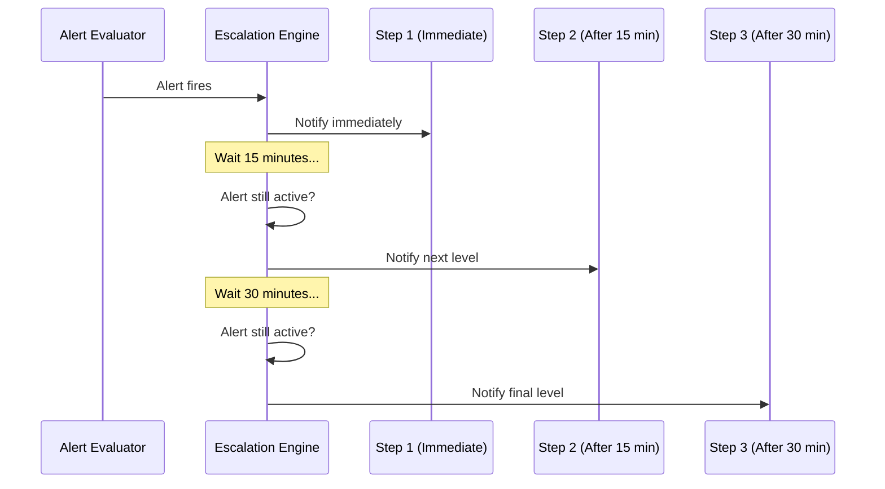

# Escalation Teams

An **escalation team** defines who gets notified when an alert fires and how notifications escalate if the alert isn't resolved. Each team has one or more steps, each with its own delay and notification channels.

---

## How Escalation Works

```mermaid
sequenceDiagram
    participant Eval as Alert Evaluator
    participant Engine as Escalation Engine
    participant Step1 as Step 1 (Immediate)
    participant Step2 as Step 2 (After 15 min)
    participant Step3 as Step 3 (After 30 min)

    Eval->>Engine: Alert fires
    Engine->>Step1: Notify immediately
    Note over Engine: Wait 15 minutes...
    Engine->>Engine: Alert still active?
    Engine->>Step2: Notify next level
    Note over Engine: Wait 30 minutes...
    Engine->>Engine: Alert still active?
    Engine->>Step3: Notify final level
```

1. An [alert configuration](./alert-configurations.md) fires and creates an alert
2. The escalation engine picks up the alert and starts at **Step 1**
3. If the alert is still active after the delay defined on the next step, notifications advance to **Step 2**
4. This continues through all defined steps
5. If **repeat** is enabled, the cycle starts over from Step 1

The escalation engine runs on a **10-second cycle**, checking for alerts that need escalation.

---

## Creating an Escalation Team

Navigate to **Alerting → Escalation Teams** and click **Add Team**.

### Team Fields

| Field | Required | Description |
|-------|----------|-------------|
| Name | Yes | Display name for the team (e.g., "Network Operations", "After-Hours On-Call") |
| Description | No | Notes about the team's purpose |
| Enabled | Yes | Whether the team is active (default: yes) |
| Schedule Type | Yes | When the team is active — see [Schedules](#schedules) |
| Repeat Enabled | No | Whether to loop back to Step 1 after all steps complete |
| Repeat Interval | No | Minutes between repeat cycles (if repeat is enabled) |
| Max Repeats | No | Maximum number of repeat cycles (0 = unlimited) |

---

## Escalation Steps

Each team has one or more **steps**, executed in order. Every step has:

| Field | Description |
|-------|-------------|
| Step Order | Execution order (1, 2, 3, ...) |
| Delay | Minutes to wait before this step fires (0 for the first step — immediate) |
| Channels | One or more notification channels to use at this step |

### Example Setup

| Step | Delay | Channel | Target |
|------|-------|---------|--------|
| 1 | Immediate | Email | on-call engineer |
| 2 | 15 minutes | Slack + Email | team lead |
| 3 | 30 minutes | Teams + Email | operations manager |

If the alert is acknowledged or resolved before a step's delay elapses, that step is skipped.

---

## Notification Channels

Each step can use one or more notification channels.

| Channel | Configuration | Status |
|---------|--------------|--------|
| **Email** | One or more email addresses | Available |
| **Slack Webhook** | Incoming webhook URL, optional channel and username override | Available |
| **Microsoft Teams Webhook** | Incoming webhook URL | Available |
| **Generic Webhook** | URL and optional custom headers | Available |
| **SMS**        | Phone numbers | Available — requires Twilio configuration; see [Twilio Integration](/docs/integrations/external-notifications) |
| **Voice Call** | Phone numbers | Available — requires Twilio configuration; see [Twilio Integration](/docs/integrations/external-notifications) |

### Email

Specify one or more email addresses per step. Emails include the alert severity, node name and IP, metric value, threshold, and triggered time.

### Slack

Provide a Slack incoming webhook URL. Notifications are sent as formatted Slack Block Kit messages with alert details.

### Microsoft Teams

Provide a Teams incoming webhook URL. Notifications are sent as Adaptive Cards that include:
- Alert severity and type
- Node name and IP address
- Current metric value and threshold
- Triggered timestamp
- An **Acknowledge** action button linking directly to the alert in Stratora

### Generic Webhook

Send a JSON payload via HTTP POST to any URL. You can add custom headers for authentication or routing.

### Testing Channels

Before saving, use the **Test** button to send a test notification through any channel. This verifies that webhooks, email addresses, and integrations are configured correctly.

---

## Schedules

<!-- Schedules section is being updated for the 2.1.10 GA release. Active hours and Time-Based scheduling behavior are being refined; see release notes when 2.1.X ships. -->

---

## On-Call Rotation

Rotation members define the on-call roster. Each member has:

| Field | Description |
|-------|-------------|
| Position | Order in the rotation roster (1, 2, 3, ...) |
| Name | Display name |
| Email | Email address for notifications |
| Phone | Phone number for SMS and voice notifications. Use E.164 format (e.g., `+18005551234`) — required by Twilio for delivery. |
| Contact | Optional link to a [contact](./contacts.md) record |

### Position vs. On-Call #N — important distinction

A rotation member's **Position** is a fixed slot in the roster — it determines the rotation order, not who is currently on-call. **On-Call #1**, **On-Call #2**, etc. are *rotation-relative* targets evaluated at alert time:

- **On-Call #1** = whoever is currently on-call **right now**.
- **On-Call #2** = whoever takes over at the **next** rotation handoff.
- **On-Call #3** = the person after that, and so on.

#### Example

A team has three members in roster order: Alice (Position 1), Bob (Position 2), Carol (Position 3). The rotation period is 7 days, and today Bob is on-call.

| Target | Resolves To | Why |
|--------|-------------|-----|
| **On-Call #1** | Bob | Bob is the current on-call |
| **On-Call #2** | Carol | Carol is next in the rotation |
| **On-Call #3** | Alice | Rotation wraps around |

Next week, after the handoff, **On-Call #1** will be Carol — not Alice — even though Alice is at Position 1 in the roster. The roster Position controls *order*; the **On-Call #N** target tracks *who's actually up* at the moment the alert fires.

### Reordering and removing members

- **Reordering** the roster (drag to change Position) changes who comes next in the rotation. The currently on-call member does not change immediately — the next handoff is the first time the new order takes effect.
- **Removing** a member who is currently on-call advances the rotation: the next member in the new roster becomes On-Call #1 immediately.

### On-Call Targeting

Escalation step channels can target rotation members dynamically:

| Target | Who Gets Notified |
|--------|------------------|
| **On-Call #1 (Current)** | Whoever is currently on-call |
| **On-Call #2 (Next)** | Whoever takes over at the next handoff |
| **On-Call #3, #4, ...** | Subsequent positions in the rotation cycle |
| **All On-Call** | Every member in the roster |
| **Specific contacts** | Fixed recipients (not rotation-aware) |

This lets you build steps like: "Notify On-Call #1 immediately, then escalate to On-Call #2 after 15 minutes if unresolved."

:::tip
SMS and voice notifications require Twilio to be configured in **Settings → External Notifications → SMS & Voice**. See [Twilio Integration](/docs/integrations/external-notifications) for setup, modes, and 10DLC registration requirements.
:::

---

## Repeat Behavior

When repeat is enabled and all steps have been exhausted without the alert being resolved:

1. The escalation resets to **Step 1**
2. The cycle repeats after the configured **repeat interval**
3. Repeats continue up to **max repeats** (or indefinitely if set to 0)

This ensures critical alerts don't go unnoticed if the initial notifications are missed.

---

## Resolution Notifications

When an alert resolves, the escalation engine automatically sends **resolution notifications** to all channels that were previously notified during the alert's lifetime. This ensures everyone who was alerted knows the issue has been cleared.

Resolution notifications are sent only once per channel, even if the channel was notified across multiple escalation steps.

---

## Linking to Alert Configurations

Escalation teams are assigned to [alert configurations](./alert-configurations.md). When an alert fires from a configuration that has an escalation team assigned, the team's escalation process begins automatically.

One escalation team can be shared across multiple alert configurations.
