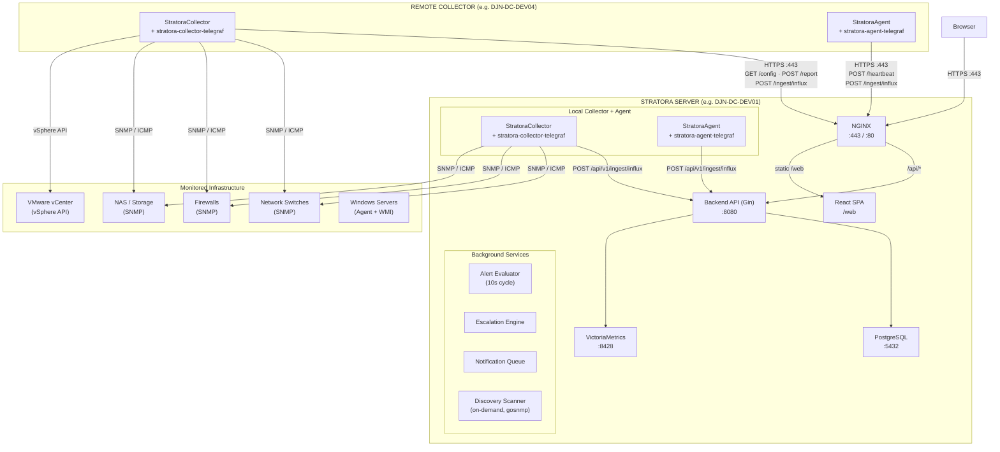
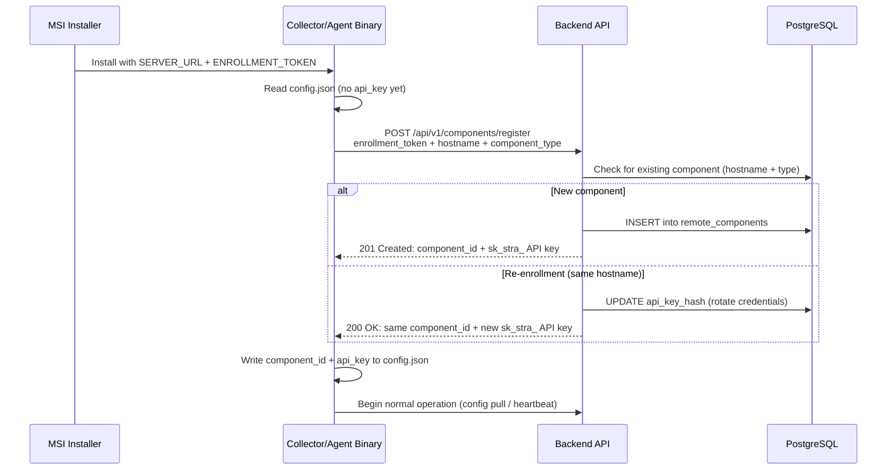
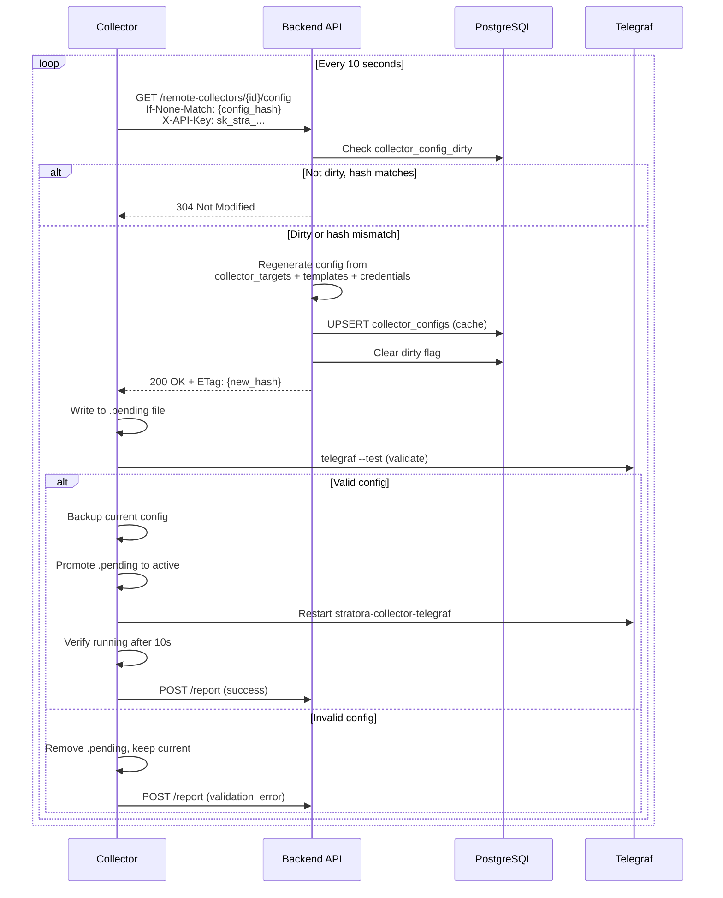
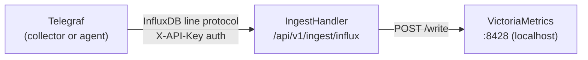

# Stratora Architecture

## Overview

Stratora is a distributed infrastructure monitoring platform designed for manufacturing IT environments and MSPs. It follows a central-server architecture with remote collectors and agents, deployed on-premises to support OT/IT network segmentation.

---

## Component Diagram

---

## Communication Protocols

| Flow | Protocol | Endpoint | Interval | Auth |
|------|----------|----------|----------|------|
| Collector config pull | HTTPS GET | `/api/v1/remote-collectors/{id}/config` | 10s | `X-API-Key` (sk_stra_) |
| Collector status report | HTTPS POST | `/api/v1/remote-collectors/{id}/report` | On config change | `X-API-Key` |
| Agent heartbeat | HTTPS POST | `/api/v1/agents/heartbeat/{node_id}` | 10s | `X-API-Key` |
| Metric ingest | HTTPS POST | `/api/v1/ingest/influx` (InfluxDB line protocol) | 10s flush | `X-API-Key` |
| Component enrollment | HTTPS POST | `/api/v1/components/register` | Once (at install) | Enrollment token |
| Discovery scans | Internal (server goroutine) | N/A | On demand | N/A |
| Frontend API | HTTPS | `/api/v1/*` | On demand | Session cookie / JWT |
| PromQL queries | Internal HTTP | VictoriaMetrics `:8428/api/v1/query*` | On demand | N/A (localhost) |

---

## Enrollment Flow

**Key properties:**
- Enrollment token is multi-use — same token deploys unlimited collectors/agents
- Re-enrollment rotates the API key without creating duplicates
- Each component (collector or agent) gets its own independent `sk_stra_` API key
- Enrollment tokens are SHA-256 hashed; component API keys are bcrypt-hashed

---

## Config Delivery Flow

**Dirty flag triggers:**
- Node created, updated, deleted, or reassigned
- Credential updated, attached, or detached
- Device template reloaded
- Server startup (all online collectors marked dirty)

**Debounce:** 5-second window batches rapid changes into a single config regeneration.

---

## Polling Intervals

| Target | Default | Exception Reason |
|--------|---------|-----------------|
| All collection (SNMP, ping, system) | 10s | Balance between freshness and load |
| QNAP NAS SNMP | 60s | Heavy MIB walks |
| Synology NAS SNMP | 60s | Heavy MIB walks |
| vCenter vSphere API | 300s | VMware API rate limits |
| SSL certificate checks | 300s | Certificates don't change frequently |
| Config debounce window | 5s | Batch rapid changes |
| Node unreachable threshold | 300s | Industry standard (5 min) |
| Alert evaluator cycle | 10s | Real-time alerting |
| Frontend refetch interval | 10s | Dashboard freshness |

---

## Windows Services

| Service Name | Binary | Purpose | Runs On |
|-------------|--------|---------|---------|
| `StratoraBackend` | backend.exe | Go/Gin API server | Server only |
| `StratoraNginx` | nginx.exe | HTTPS reverse proxy + static files | Server only |
| `StratoraVictoriaMetrics` | victoria-metrics.exe | Time-series database | Server only |
| `postgresql-x64-17` | pg_ctl.exe | PostgreSQL metadata database | Server only |
| `StratoraCollector` | collector.exe | Manages collector Telegraf lifecycle | Server + remote collectors |
| `stratora-collector-telegraf` | telegraf.exe | SNMP/ICMP/vSphere polling | Server + remote collectors |
| `StratoraAgent` | stratora-agent.exe | Manages agent Telegraf lifecycle | All monitored Windows servers |
| `stratora-agent-telegraf` | telegraf.exe | Local system metrics (WMI) | All monitored Windows servers |

---

## Directory Structure

| Path | Purpose |
|------|---------|
| `C:\Program Files\Stratora\Collector\` | Collector binary + Telegraf binary |
| `C:\Program Files\Stratora\Collector\telegraf\` | Telegraf executable for collector |
| `C:\ProgramData\Stratora\Collector\config.json` | Collector credentials (component_id, api_key, server_url) |
| `C:\ProgramData\Stratora\Collector\telegraf\` | Server-generated Telegraf config (telegraf.conf) |
| `C:\ProgramData\Stratora\Collector\logs\` | Collector + Telegraf logs (with rotation) |
| `C:\Program Files\Stratora\Agent\` | Agent binary + Telegraf binary |
| `C:\Program Files\Stratora\Agent\config.json` | Agent credentials (component_id, api_key, server_url) |
| `C:\ProgramData\Stratora\Agent\logs\` | Agent + Telegraf logs |

---

## Health Status Model

| Status | Meaning | Set By | Trigger |
|--------|---------|--------|---------|
| Discovering | Node recently added or reassigned, awaiting first data | Node creation / collector reassignment | Automatic on create/reassign |
| Healthy | Node reachable, no threshold breaches | Alert evaluator | Successful data collection |
| Warning | Node reachable, metric threshold warning | Alert evaluator | Warning-level alert active |
| Critical | Node reachable, metric threshold critical | Alert evaluator | Critical-level metric alert active |
| Offline | Node unreachable for 5+ minutes | Alert evaluator | Reachability alert (node_unreachable, agent_heartbeat) |
| Maintenance | Planned maintenance window | Admin | Manual or scheduled |

---

## Discovery Scans

Discovery scans run **server-side only** as goroutines using the `gosnmp` library. The scan pipeline:

1. Admin creates a discovery job (target CIDR, SNMP community, scan options)
2. Server spawns a background goroutine (`runScan`)
3. Phase 1: ICMP/TCP ping sweep (optional)
4. Phase 2: SNMP probe — queries sysDescr, sysObjectID, sysName, sysLocation, sysContact
5. Phase 3: Template fingerprinting — matches sysObjectID against `device_template_fingerprints`
6. Phase 4: DNS lookup (optional)
7. Results stored in `discovered_devices` table
8. Admin imports discovered devices into monitoring (auto-assigns first approved collector)

**Current limitation:** Remote collectors have no discovery capability. Subnets only reachable from a remote collector's network cannot be scanned. This is a planned enhancement — the collector would poll a discovery job queue and execute scans locally.

---

## Metric Ingest Path

All metrics flow through the **authenticated backend ingest proxy**. VictoriaMetrics is bound to `127.0.0.1:8428` and is not directly accessible from remote collectors.

---

## Key Database Tables

| Table | Purpose |
|-------|---------|
| `nodes` | All monitored devices (network, server, storage, etc.) |
| `remote_components` | Registered collectors and agents (enrollment, API keys, heartbeats) |
| `collector_targets` | Which nodes are assigned to which collector |
| `collector_config_dirty` | Dirty flag for config regeneration with debounce timestamp |
| `collector_configs` | Cached generated Telegraf configs per collector (hash-based) |
| `alerts` | Active and historical alerts with state tracking |
| `alert_definitions` | Built-in and custom alert rules with PromQL conditions |
| `credentials` | SNMP communities, WMI credentials (AES-256-GCM encrypted) |
| `device_templates` | Telegraf config templates per device type |
| `device_template_fingerprints` | sysObjectID patterns for auto-detection during discovery |
| `discovery_jobs` | Discovery scan jobs (target CIDR, status, results count) |
| `discovered_devices` | Devices found during discovery scans |

---

## Authentication

### User Authentication
1. User submits credentials to `POST /api/v1/auth/login`
2. Backend validates against local database or LDAP/Active Directory
3. Session token stored in HTTP-only cookie
4. Subsequent requests validated via middleware

### Component Authentication (Collectors/Agents)
1. `X-API-Key: sk_stra_...` header on every request
2. Backend validates against `remote_components.api_key_hash` (bcrypt)
3. Approval gate: unapproved collectors receive 403 Forbidden

### Role-Based Access Control

| Role | Capabilities |
|------|--------------|
| Admin | Full access, user management, settings, credential management |
| Operator | Manage nodes, dashboards, alerts, attach credentials |
| Viewer | Read-only access to dashboards, nodes, and masked credentials |

---

## Deployment Patterns

### Single Server
All components on one machine. Suitable for small environments (< 100 nodes), development, and proof of concept.

### Distributed Collectors
Backend centralized, collectors deployed at remote sites. Suitable for multi-site deployments, IT/OT network segmentation, and scale-out metric collection. Verified in production with DJN-DC-DEV01 (local) + DJN-DC-DEV04 (remote).

### High Availability (Planned)
- Backend clustering with shared PostgreSQL
- VictoriaMetrics cluster mode
- Load balancer for frontend

---

## Technology Stack

| Layer | Technology | Why |
|-------|------------|-----|
| Backend | Go 1.24, Gin | Performance, concurrency, single binary |
| Frontend | React 19, TypeScript, Tailwind, Vite | Component model, ecosystem, React Query |
| Metrics DB | VictoriaMetrics | PromQL, compression, performance |
| Metadata DB | PostgreSQL | Reliability, JSONB support, migrations |
| Collection | Telegraf | Plugin ecosystem, SNMP support, stability |
| Reverse Proxy | NGINX | TLS termination, static file serving |
| Visualization | React Flow, Recharts | Topology maps, charts |
