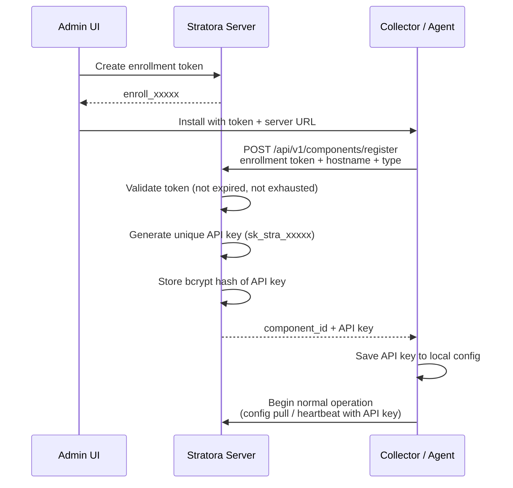

# Enrollment

Enrollment is how [collectors](./collectors.md) and agents register with the Stratora server. It uses a **token-based flow** — you create a temporary enrollment token in the UI, then pass it to the installer. The component uses the token to register and receives a unique, permanent API key for ongoing authentication.

This design keeps deployment simple (one shareable token for a batch of installs) while maintaining security (each component gets its own isolated API key).

---

## How Enrollment Works



After enrollment:
- The **enrollment token** can be discarded (or reused for more installs if it's multi-use)
- The **API key** (`sk_stra_xxxxx`) is the component's permanent credential for all communication with the server
- The server stores only a **bcrypt hash** of the API key — the plain-text key exists only on the component itself

---

## Enrollment Tokens

### Creating a Token

Navigate to **Administration → Enrollment Tokens** and click **Create Token**.

| Field | Required | Description |
|-------|----------|-------------|
| Description | No | Label for the token's purpose (e.g., "Q1 branch office rollout") |
| Multi-use | No | Whether the token can be used by more than one component (default: single-use) |
| Max uses | No | For multi-use tokens, an optional cap on total registrations |
| Expiration | No | How long the token is valid (default: 24 hours; set to 0 for no expiry) |

### Single-Use vs. Multi-Use

| | Single-Use | Multi-Use |
|---|-----------|-----------|
| **Registrations** | Exactly one | Unlimited (or up to max uses) |
| **Use case** | One-off installs, high-security environments | Batch deployments, automated rollouts |
| **Consumed** | After first registration | When max uses reached or token expires |

### Token Lifecycle

A token becomes **exhausted** (can no longer be used) when:
- **Single-use**: it has been used once
- **Multi-use with limit**: `use_count >= max_uses`
- **Any token**: the current time is past `expires_at`

:::tip
For automated deployments, create a multi-use token with a reasonable expiration (e.g., 7 days) and use limit. This gives your deployment tools a window to install, while limiting exposure if the token is leaked.
:::

---

## Re-Enrollment

If a collector or agent needs to be reinstalled on the same host (e.g., after a rebuild), re-enrollment is automatic. When a component registers with a hostname that already exists:

- The existing record is updated (not duplicated)
- A **new API key** is generated and the old one is invalidated
- The component resumes normal operation with the new key

This means you can reimage a server and reinstall the agent with the same enrollment token — it just works.

---

## Per-Component API Keys

Every enrolled component receives its own unique API key (`sk_stra_xxxxx`). This isolation means:

- **Revoking one component doesn't affect others** — even if they were enrolled with the same token
- **Key compromise is contained** — if a single agent's key is exposed, only that agent needs to be re-enrolled
- **Audit trail is per-component** — every API call is traceable to a specific agent or collector

### Key Format

```
sk_stra_aB-cD_eFghIjKlMnOpQrStUvWxYzABC-DeF_GhIjKlMnOpQr
```

- Prefix: `sk_stra_` (identifies it as a Stratora API key)
- Body: 43 characters of base64url-encoded random data (256 bits of entropy)

### Revocation

To revoke a component's access:

1. Navigate to **Administration → Collectors** or **Agents**
2. Select the component
3. Click **Revoke**

The component's status changes to **revoked** and all API calls using its key are immediately rejected. Other components are unaffected.

---

## Bulk Deployment

Enrollment is designed for mass deployment via common IT automation tools:

| Tool | Approach |
|------|----------|
| **PDQ Deploy** | Push the MSI with `SERVER_URL` and `ENROLLMENT_TOKEN` parameters |
| **SCCM / MECM** | Deploy as an application with silent install command line |
| **Intune** | Package as a Win32 app (`.intunewin`) with install parameters |
| **Ansible** | Use `win_package` module with MSI path and parameters |
| **GPO** | Deploy via Group Policy Software Installation with transform file |

All tools use the same silent install command:

```cmd
msiexec /i StratoraCollector.msi /qn SERVER_URL="https://stratora.example.com" ENROLLMENT_TOKEN="enroll_xxxxx"
```

Create a multi-use token with a use limit matching your expected deployment count and a short expiration window (e.g., 48 hours for a weekend rollout).

---

## Security Model

| Layer | Mechanism |
|-------|-----------|
| **Token storage** | SHA-256 hashed — the plain-text token is never stored in the database |
| **Token reveal** | Optionally encrypted with AES-256-GCM for admin recovery |
| **API key storage** | bcrypt hashed (cost factor 12) — resistant to brute-force even if the database is compromised |
| **API key prefix** | First 12 characters stored for identification (e.g., `sk_stra_aB-c...`) without exposing the full key |
| **Token expiration** | Time-limited by default (24 hours) to reduce window of exposure |
| **Use limits** | Single-use or capped multi-use to prevent unlimited enrollment |
| **Per-component isolation** | Each component gets a unique key; revoking one doesn't affect others |

:::warning
Treat enrollment tokens like temporary passwords. Use short expiration windows, set use limits for multi-use tokens, and delete unused tokens after your deployment is complete.
:::

---

## Component Statuses

After enrollment, components move through these statuses:

| Status | Meaning |
|--------|---------|
| **Active** | Component is enrolled and communicating normally |
| **Offline** | Component has missed heartbeats (network issue or service stopped) |
| **Revoked** | Access has been manually revoked — all API calls rejected |
