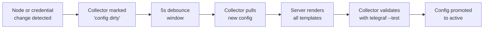

# Device Templates

A **device template** defines _what_ Stratora collects from a device and _how_ it presents the data. Templates are the bridge between a node's type and its monitoring configuration — they specify SNMP OIDs, agent plugins, dashboard panels, and default alert thresholds.

When you assign a template to a node, Stratora generates a Telegraf configuration tailored to that device and begins collecting the metrics defined in the template.

---

## How Templates Work

Each template contains:

| Component | Purpose |
|-----------|---------|
| **Metric definitions** | What to collect — SNMP OIDs, WMI classes, agent plugins, or API calls |
| **Telegraf config** | A TOML template that Stratora renders with the node's IP, credentials, and tags |
| **Dashboard layout** | Panels (gauges, charts, tables) that appear on the node's detail view |
| **Alert rules** | Default warning and critical thresholds for key metrics |
| **Credential requirements** | What authentication the template needs (SNMP community, API user, etc.) |

When a collector pulls its configuration from the Stratora server, the server:

1. Looks up each node assigned to that collector
2. Resolves the node's device template
3. Renders the Telegraf config template with the node's specific values (IP, credentials, collection interval, tags)
4. Combines all rendered configs into a single Telegraf configuration for the collector
5. Returns the config with an ETag hash for change detection

This happens automatically. Collectors poll for config changes every 10 seconds and apply updates with zero downtime.

---

## Built-in Templates

Stratora ships with templates for common infrastructure. Templates are organized by category.

### Servers

| Template | Protocol | What It Collects |
|----------|----------|-----------------|
| **Windows Server** | Agent | CPU (per-core), memory, disk usage/IO, network throughput, Windows services, event log, uptime. Auto-detects roles: AD DS, DNS, DHCP, SQL Server, IIS, Hyper-V — and adds role-specific metrics. |
| **Linux Server** | Agent | CPU (per-core), memory, disk, network, systemd services. Auto-detects running services and collects role-specific metrics for web servers, databases, and more. |

### Network

| Template | Protocol | What It Collects |
|----------|----------|-----------------|
| **Cisco Catalyst Switch** | SNMP | CPU, memory, temperature sensors, per-interface traffic (64-bit counters), interface errors, port status. Supports Catalyst 2960, 3560, 3750, 3850, 9200, 9300, 9500 series. |
| **Cisco SG300 Switch** | SNMP | CPU (1-min and 5-min), per-interface traffic, port status grid. Supports SG300-10/20/28/52 and PoE variants. |
| **Ubiquiti UniFi Switch** | SNMP | Per-interface traffic, port status, device metrics. |

### Firewalls

| Template | Protocol | What It Collects |
|----------|----------|-----------------|
| **Palo Alto Firewall** | SNMP | Management CPU, data-plane CPU, session utilization, active sessions, throughput, connections/sec, GlobalProtect tunnel count, HA state. Supports PA-220 through PA-7000 series. |

### Storage

| Template | Protocol | What It Collects |
|----------|----------|-----------------|
| **Synology NAS** | SNMP | System temperature, CPU, memory, individual disk health, RAID status, volume capacity, network traffic, storage IO. |
| **QNAP NAS** | SNMP | System/disk temperature, fan speed, CPU, memory, disk status (GOOD/WARNING/ERROR), volume capacity and status. |

### VMware

| Template | Protocol | What It Collects |
|----------|----------|-----------------|
| **VMware ESXi Host** | SNMP | Product version/build, CPU count, memory, VM inventory (name, guest OS, config path), datastore usage, per-vmnic network throughput. |
| **VMware vCenter Server** | vSphere API | Cluster-level resources, per-host CPU/memory/uptime/connection state, per-VM CPU/memory/disk latency/network, datastore capacity. Collects 34 metrics across clusters, hosts, VMs, and datastores. |

### Wireless

| Template | Protocol | What It Collects |
|----------|----------|-----------------|
| **Aruba Instant AP** | SNMP | Connected clients by SSID, per-AP CPU and memory, radio client count, radio utilization (2.4 GHz / 5 GHz). |

### Connectivity

| Template | Protocol | What It Collects |
|----------|----------|-----------------|
| **Ping** | ICMP | Response time (min/avg/max), packet loss percentage, reachability status. |
| **HTTP/HTTPS** | HTTP | Response time, HTTP status code, availability percentage, SSL certificate details (expiry date, issuer, days until expiry). |

---

## Template Auto-Assignment

During [network discovery](../collection/discovery.md), Stratora uses a multi-signal fingerprinting engine to identify devices and match them to the correct template.

### How Fingerprinting Works

The discovery engine collects signals from each host and scores them by confidence:

| Signal | Confidence | How It Works |
|--------|------------|-------------|
| SNMP sysObjectID | High | Matches the vendor enterprise OID against a built-in fingerprint database |
| SNMP sysDescr | High | Keyword matching against known device description patterns |
| HTTP banner | Medium–High | Identifies devices by web interface headers, page titles, and TLS certificate fields |
| MAC address (OUI) | Medium | IEEE vendor prefix lookup identifies the hardware manufacturer |
| Open port profile | Medium | Port combinations suggest device type (e.g., 135+445 = Windows) |
| Hostname pattern | Low | FQDN matching as a tiebreaker |

When a high-confidence signal matches (sysObjectID, sysDescr, or HTTP banner), the template is assigned immediately. When no single signal is conclusive, multiple signals are aggregated — if two or more signals agree, confidence gets a boost.

### Example

A discovery scan finds a device at `10.1.5.1`:
1. SNMP returns sysObjectID `1.3.6.1.4.1.25461.2.1.2.12` → matches Palo Alto
2. Stratora assigns the **Palo Alto Firewall** template automatically
3. When you import the device, it's ready to monitor with the correct OIDs and dashboard

---

## What a Template Generates

Here's what happens under the hood when a node has a template assigned.

### Telegraf Configuration

The template's TOML config is rendered with the node's specific values:

- **IP address** and **hostname** of the target device
- **SNMP credentials** — community string, or SNMPv3 user/auth/privacy settings
- **Collection interval** — typically 10 seconds (60s for NAS devices, 300s for vCenter)
- **Node metadata** — node ID and name are injected as Telegraf tags so every metric is traceable back to its source

The rendered config is delivered to the assigned collector, which applies it to its local Telegraf instance.

### Dashboard Panels

Each template defines a dashboard layout with panels tailored to the device type:

- **Gauges** — real-time values for CPU, memory, session utilization
- **Time-series charts** — CPU/memory/network over time, disk IO trends
- **Tables** — interface status, VM inventory, disk health, service status
- **Status indicators** — port grids, RAID status, HA state

The dashboard is automatically displayed on the node's detail view. No manual dashboard configuration is needed.

### Alert Rules

Templates include default alert thresholds that are applied when the node is created. For example, a Windows Server template may include:

- CPU usage > 90% for 5 minutes → **Critical**
- Memory usage > 85% for 5 minutes → **Warning**
- Disk usage > 90% → **Warning**
- Disk usage > 95% → **Critical**

These defaults can be customized per-node through [alert definitions](../alerting/alert-definitions.md).

---

## Template-Driven Config Generation

The config generation pipeline runs automatically whenever a node's configuration changes (template assignment, credential update, collector reassignment, or node edit).

**Dirty flag triggers:**
- Node created, updated, deleted, or reassigned to a different collector
- Credentials updated, attached, or detached from a node
- Device template modified or reloaded
- Server restart (all online collectors marked dirty)

A 5-second debounce window batches rapid changes so a burst of edits produces only one config regeneration.

:::info
Config delivery uses ETag-based caching. If nothing changed, the collector receives a `304 Not Modified` response and skips the update entirely.
:::

---

## Template Categories Reference

| Category | Templates | Protocol |
|----------|-----------|----------|
| Server | Windows Server, Linux Server | Agent |
| Network | Cisco Catalyst, Cisco SG300, Ubiquiti UniFi | SNMP |
| Firewall | Palo Alto | SNMP |
| Storage | Synology NAS, QNAP NAS | SNMP |
| VMware | ESXi Host, vCenter Server | SNMP / vSphere API |
| Wireless | Aruba Instant AP | SNMP |
| Connectivity | Ping, HTTP/HTTPS | ICMP / HTTP |
