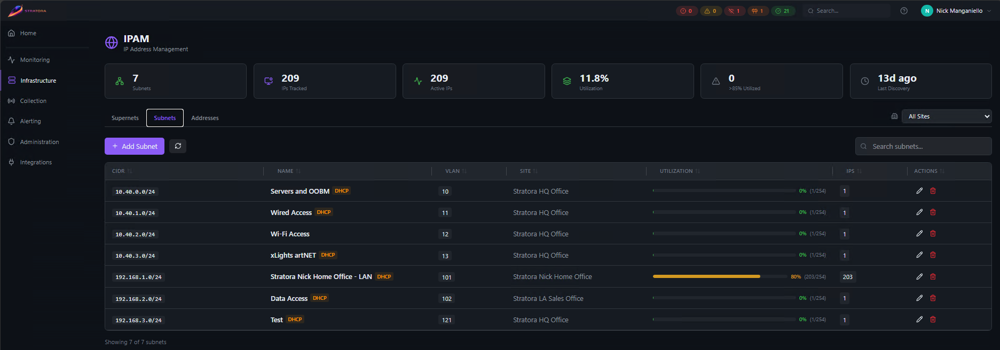

# IPAM

Stratora includes a built-in **IP Address Management (IPAM)** module for tracking IP address space across your infrastructure. It organizes address blocks into a hierarchy of supernets and subnets, tracks individual IP allocations, monitors utilization, and integrates with discovery scanning to keep records up to date.

---

## Concepts

### Supernets

A **supernet** is a large address block used for top-level organization — typically a summary route or aggregate allocation like `10.0.0.0/8` or `172.16.0.0/12`. Supernets group related subnets together and can be associated with a [site](./sites.md).

Supernets are optional. You can create subnets without a parent supernet if your network is flat.

### Subnets

A **subnet** is an individual network segment — the working unit of IPAM. Each subnet has a CIDR range, an optional VLAN tag, and tracks the IP addresses within it.

| Field | Required | Description |
|-------|----------|-------------|
| CIDR | Yes | Network range (e.g., `10.1.20.0/24`) |
| Name | Yes | Friendly name (e.g., "Server VLAN 20") |
| Description | No | Notes about the subnet's purpose |
| Site | No | Associated site |
| Supernet | No | Parent supernet for hierarchical organization |
| VLAN ID | No | 802.1Q VLAN tag (1–4094) |
| Gateway IP | No | Default gateway address |
| DHCP | No | Whether this subnet uses DHCP |

:::info
When you set a gateway IP on a subnet, Stratora automatically creates an address record for that IP and marks it as a gateway. If the gateway IP changes, the old record is updated automatically.
:::

### Addresses

An **address** is a single IP within a subnet. Address records track:

- **Status** — active, inactive, reserved, or available
- **Hostname** — associated DNS name
- **MAC address** — hardware address of the device
- **Linked node** — connection to a monitored [node](./nodes.md) if one exists
- **DNS PTR record** — reverse DNS result with mismatch detection
- **Last seen** — when the address was last detected (via discovery or monitoring)
- **Gateway flag** — whether this address is the subnet gateway
- **DHCP range flag** — whether this address falls within a defined DHCP scope

---

## Navigating IPAM

The IPAM interface is organized into three tabs:

### Supernets Tab

Lists all supernets with their associated site and the count of child subnets. Click a supernet to see its subnets.

### Subnets Tab

Lists all subnets with utilization bars showing how much of the address space is tracked. The utilization bar is color-coded:

- **Green** (0–70%) — healthy utilization
- **Yellow** (70–85%) — approaching capacity
- **Red** (>85%) — high utilization, may need attention

Click a subnet to drill into its address list, DHCP ranges, and utilization details.

### Addresses Tab

A searchable, filterable table of all tracked IP addresses across all subnets. Filter by subnet, status, site, or search by IP/hostname.

{/*  */}

---

## Utilization Tracking

Stratora calculates subnet utilization as:

```
utilization = (tracked addresses / usable addresses) × 100
```

**Usable addresses** is the total host count for the prefix minus the network and broadcast addresses. For example, a `/24` has 254 usable addresses.

The IPAM statistics dashboard shows:

- Total supernets, subnets, and tracked addresses
- Breakdown by status (active, inactive, reserved, available)
- Overall utilization percentage
- Count of high-utilization subnets (>85%)
- Last discovery scan timestamp

---

## Gateway Tracking

When you define a gateway IP on a subnet, Stratora:

1. Creates (or updates) an address record for that IP
2. Sets the **is_gateway** flag on the record
3. Displays a gateway badge on the address in the UI

If you change the gateway IP, the old address record has its gateway flag cleared and the new one is flagged. Existing data on the address record (hostname, MAC, notes) is preserved.

---

## DHCP Ranges

For subnets that use DHCP, you can define one or more **DHCP ranges** (scopes) within the subnet.

From the subnet detail view, go to **DHCP Ranges** and click **Add Range**:

| Field | Required | Description |
|-------|----------|-------------|
| Start IP | Yes | First address in the DHCP scope |
| End IP | Yes | Last address in the DHCP scope |
| Description | No | Notes (e.g., "Workstation pool", "Guest range") |

A subnet can have multiple DHCP ranges. Addresses that fall within a defined range are automatically flagged as **in DHCP range** in the address list, helping you distinguish statically assigned addresses from DHCP leases.

---

## MAC Address Tracking

Each address record can store a **MAC address**. MAC data is populated through:

- Discovery scans that capture ARP/neighbor table data
- Manual entry for statically assigned devices

MAC addresses help identify which physical device holds an IP — useful for troubleshooting IP conflicts, tracking hardware moves, and correlating with switch port data.

---

## DNS Integration

Stratora can perform **reverse DNS (PTR) lookups** on address records to verify that DNS matches the observed IP assignment.

### PTR Record Lookup

For any address, you can trigger a DNS refresh that:
1. Performs a reverse PTR lookup on the IP
2. Stores the result on the address record
3. Performs a forward lookup on the PTR result
4. Flags a **DNS mismatch** if the forward lookup doesn't resolve back to the same IP

### Mismatch Detection

A DNS mismatch indicates that forward and reverse DNS are out of sync — a common issue in environments where DNS records aren't cleaned up after server decommissions or IP changes. Mismatched addresses are highlighted in the UI so you can investigate.

---

## Relationship to Discovery

IPAM and [discovery scanning](../collection/discovery.md) work together:

- **Discovery populates IPAM** — when a discovery scan finds live hosts, their IP addresses are automatically upserted into the IPAM address table with status, hostname, and last-seen timestamps
- **IPAM feeds discovery targets** — you can run discovery scans scoped to IPAM subnets, supernets, or entire sites
- **Stale address detection** — addresses that haven't been seen in a configurable number of hours can be flagged as stale, helping you identify decommissioned devices or changed IPs

:::tip
Run periodic discovery scans against your IPAM subnets to keep address records current. This ensures utilization numbers stay accurate and stale records are surfaced.
:::

---

## Address Statuses

| Status | Meaning |
|--------|---------|
| **Active** | Address is in use — responding to scans or linked to a monitored node |
| **Inactive** | Address was previously seen but is no longer responding |
| **Reserved** | Address is reserved for a specific purpose (manually set) |
| **Available** | Address is unoccupied and available for assignment |
