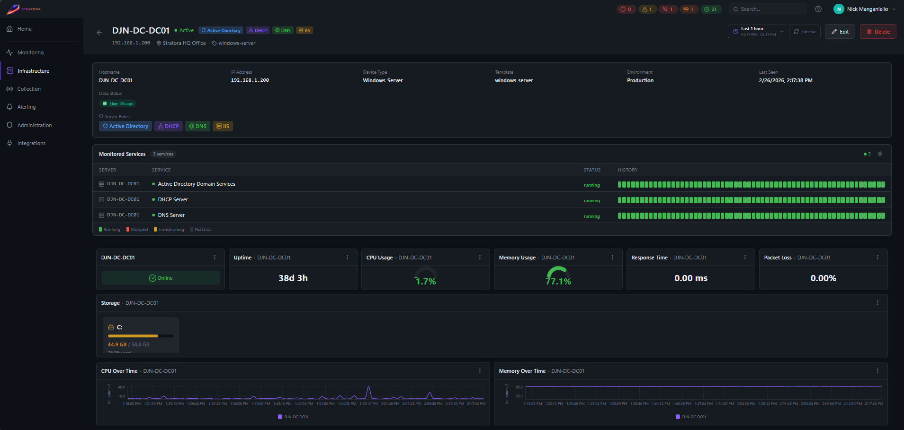

# Nodes

A **node** is any device Stratora monitors — a Windows server, Linux box, network switch, firewall, NAS, VMware host, or anything reachable by SNMP, an agent, or a ping. Nodes are the core unit of monitoring: every metric, alert, and dashboard panel ties back to a node.

Every node belongs to a [site](./sites.md) and is assigned a device template that determines what gets collected. Nodes can also be organized into [node groups](./node-groups.md) for filtering and management.

---

## Node Types

| Type | Protocol | Examples |
|------|----------|---------|
| Windows Server | Agent (Telegraf) | Domain controllers, SQL servers, IIS, Hyper-V hosts |
| Linux Server | Agent (Telegraf) | Web servers, database servers, Docker hosts |
| Network Switch | SNMP | Cisco Catalyst, Cisco SG300/CBS, Ubiquiti UniFi |
| Firewall | SNMP | Palo Alto PA series |
| Storage (NAS/SAN) | SNMP | Synology, QNAP |
| VMware ESXi Host | SNMP | ESXi 6.x/7.x/8.x hosts |
| VMware vCenter | vSphere API | vCenter Server Appliance |
| Wi-Fi Controller / AP | SNMP | Aruba Instant APs |
| HTTP/HTTPS Endpoint | HTTP | Web apps, APIs, public URLs |
| Ping | ICMP | Any IP-reachable device |

---

## Adding Nodes

There are three ways to add nodes to Stratora.

### Manual Creation

Navigate to **Infrastructure → Nodes** and click **Add Node**. You'll need:

- **Name** — display name for the node
- **IP Address** — must be reachable from the assigned collector
- **Node Type** — select from the dropdown (Windows Server, Network Switch, etc.)
- **Site** — every node must be assigned to a site (required)
- **Device Template** — determines what metrics are collected
- **Credentials** — SNMP community, API keys, or other authentication as required by the template

The node enters **Discovering** status until the first metrics arrive.

### Via Discovery Import

Run a [network discovery scan](../collection/discovery.md) against a subnet. Stratora probes each host with ICMP, SNMP, HTTP banners, and other signals to identify device types and auto-match templates. You then review the results and import selected devices as nodes.

During import, Stratora automatically:
- Sets the node type based on fingerprinting results
- Assigns the best-matching device template
- Populates SNMP system fields (sysDescr, sysObjectID, sysName)
- Assigns the node to the site where the discovery was run
- Creates an [IPAM](./ipam.md) address record for the discovered IP

### Via Agent Enrollment

When you install the Stratora Agent on a Windows or Linux server, the agent registers itself with the Stratora server during first startup. The node appears in **Infrastructure → Nodes** with a **Pending** approval status. Once you approve the node, monitoring begins.

See [Enrollment](../collection/enrollment.md) for installation and registration details.

:::tip
Agent-enrolled nodes automatically detect installed roles and services. For example, a Windows server running Active Directory will have LDAP, DNS, and DHCP metrics collected without extra configuration.
:::

---

## Node Detail View

Click any node to open its detail view. The layout adapts based on the device template.

{/*  */}

### What You See

- **Header** — node name, IP address, type, current health status, and uptime
- **Dashboard panels** — template-driven gauges, charts, and tables for the node's key metrics (CPU, memory, disk, interface traffic, etc.)
- **System info** — OS, manufacturer, model, serial number (populated by agent or SNMP)
- **Assigned collector** — which collector is polling this node
- **Active alerts** — any currently firing alerts with severity and duration
- **Node groups** — color-coded group badges showing which [groups](./node-groups.md) this node belongs to

### Key Metrics by Type

| Node Type | Primary Metrics |
|-----------|----------------|
| Windows/Linux Server | CPU (per-core), memory, disk usage/IO, network throughput, services, uptime |
| Network Switch | Port status grid, CPU, per-interface traffic (TX/RX), interface errors |
| Firewall | Management/data-plane CPU, active sessions, throughput, connections/sec, HA state |
| NAS/Storage | Disk health, RAID status, volume capacity, temperature, read/write IO |
| VMware ESXi | CPU/memory, VM count, datastore usage, per-vmnic throughput |
| VMware vCenter | Cluster resources, top VMs by CPU/memory, datastore usage, VM latency |
| Wi-Fi Controller / AP | Connected clients by SSID, radio utilization, AP memory/CPU |
| HTTP/HTTPS | Response time, HTTP status code, availability percentage, SSL certificate expiry |
| Ping | Response time (min/avg/max), packet loss |

---

## Health Status

Every node has a health status that reflects its current state. Status is evaluated automatically by the alert engine on a 10-second cycle.

| Status | Meaning |
|--------|---------|
| **Discovering** | Node was just added — waiting for the first metrics to arrive |
| **Healthy** | Node is reachable and all metrics are within normal thresholds |
| **Warning** | Node is reachable but one or more metrics have crossed a warning threshold |
| **Critical** | Node is reachable but one or more metrics have crossed a critical threshold |
| **Offline** | No data received for 5+ minutes (unreachable) |
| **Maintenance** | Node is in a scheduled or manual maintenance window (alerts suppressed) |

:::info
Health status is driven by [alert definitions](../alerting/alert-definitions.md). The highest-severity active alert determines the node's status. If no alerts are firing and the node is reachable, it shows as **Healthy**.
:::

---

## Bulk Actions

Select multiple nodes from the node list to perform bulk operations.

### Assign to Site

Move selected nodes to a different site. Useful when reorganizing after initial setup or when a new site is created.

- Select nodes → **Actions → Move to Site** → choose target site
- Up to 500 nodes per operation
- Nodes already in the target site are skipped automatically

### Assign Collector

Change which collector polls the selected nodes. When you reassign a collector, the old collector's configuration is regenerated to remove the nodes, and the new collector picks them up on its next config pull (within ~10 seconds).

### Maintenance Mode

Place selected nodes into maintenance mode to suppress alerts during planned work. See [Maintenance Windows](../alerting/maintenance-windows.md) for details.

---

## Approval Workflow

Nodes registered via agent enrollment arrive with **Pending** approval status. This prevents unknown devices from being monitored automatically.

From the node list or detail view:
- **Approve** — activates monitoring, the collector begins polling
- **Reject** — marks the node as rejected, no monitoring occurs

:::warning
Rejected nodes remain in the database but are excluded from monitoring and dashboards. You can approve a rejected node later if needed.
:::

---

## Node Fields Reference

| Field | Description | Source |
|-------|-------------|--------|
| Name | Display name | Manual or agent hostname |
| IP Address | IPv4 address | Manual or discovery |
| Hostname | Device hostname | Agent or DNS |
| Node Type | Device category | Manual, discovery, or agent |
| Site | Parent site | Manual (required) |
| Template | Device template | Manual or discovery auto-match |
| Environment | production, staging, or development | Manual (default: production) |
| Node Groups | Color-coded group memberships | Manual |
| OS Name / Version | Operating system | Agent or SNMP sysDescr |
| Manufacturer / Model | Hardware info | Agent (WMI/DMI) or SNMP |
| Serial Number | Device serial | Agent or SNMP |
| SNMP sysObjectID | Vendor enterprise OID | SNMP probe |
| Last Seen | Timestamp of most recent data | Automatic |
