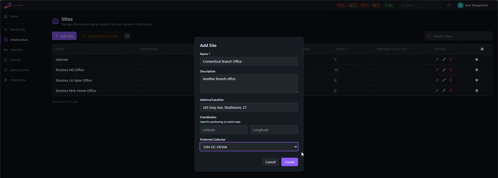

# Sites

A **site** represents a physical location or logical grouping of infrastructure — a data center, branch office, factory floor, or remote closet. Sites are the top-level organizational unit in Stratora. Every [node](./nodes.md) must belong to a site.

Sites serve three purposes:

1. **Organization** — group nodes by location so operators can quickly scope dashboards, alerts, and views to what matters
2. **Collector assignment** — each site has a preferred collector, so nodes added to a site automatically get polled by the right collector in the right network
3. **Network documentation** — sites contain network definitions (CIDRs, VLANs, gateways) that feed into [IPAM](./ipam.md) and discovery scans

---

## Creating a Site

Navigate to **Administration → Sites** and click **Add Site**.

| Field | Required | Description |
|-------|----------|-------------|
| Name | Yes | Display name (e.g., "HQ Data Center", "Building 7 MDF") |
| Description | No | Notes about the site |
| Address | No | Physical street address |
| Latitude / Longitude | No | Coordinates for world map positioning |
| Preferred Collector | No | Default collector for nodes at this site |

:::tip
If you set a **preferred collector** on the site, new nodes added to that site will automatically be assigned to that collector. This is the easiest way to ensure remote-site nodes are polled by the correct local collector.
:::

{/*  */}

---

## Assigning Nodes to Sites

Every node must belong to a site — Stratora does not allow orphaned nodes. You assign a site when:

- **Creating a node manually** — site is a required field
- **Importing from discovery** — nodes are assigned to the site where the scan was run
- **Agent enrollment** — you assign the site when approving the agent

### Moving Nodes Between Sites

To reassign nodes to a different site:

1. Go to **Infrastructure → Nodes**
2. Select one or more nodes using the checkboxes
3. Click **Actions → Move to Site**
4. Choose the target site

This is a bulk operation — you can move up to 500 nodes at once.

:::warning
Moving a node to a site with a different preferred collector will trigger a collector reassignment. The node's metrics will briefly pause while the old collector drops the target and the new collector picks it up (typically within 10–15 seconds).
:::

---

## Site Health

Each site has an aggregated health status derived from its nodes:

| Status | Meaning |
|--------|---------|
| **Healthy** | All nodes at this site are healthy |
| **Degraded** | One or more nodes have warning-level alerts |
| **Critical** | One or more nodes have critical-level alerts or are offline |
| **Maintenance** | The site is in a maintenance window |

The site health view shows a summary with counts of healthy, degraded, critical, and offline nodes. This is available from:

- **Dashboard → Sites overview** — card view with health indicators per site
- **World Map** — if latitude/longitude are set, sites appear on the map with color-coded health
- **Site detail view** — full breakdown of node health within the site

{/*  */}

---

## Preferred Collector

Each site can have a **preferred collector** — the default collector that polls nodes at that location.

### Why This Matters

In distributed deployments, you typically have one collector per physical site. The preferred collector setting ensures:

- New nodes added to the site are automatically assigned to the correct collector
- Discovery scans at the site use the local collector's network reach
- Operators don't need to manually pick a collector for every node

### Setting the Preferred Collector

1. Go to the site's detail view
2. Edit the site and select a collector from the **Preferred Collector** dropdown
3. Save

:::tip
You can override the preferred collector on individual nodes. The site preference is a default, not a hard constraint.
:::

---

## Filtering by Site

Most views in Stratora support site-based filtering:

- **Node list** — filter by site to see only nodes at a specific location
- **Alerts** — filter alerts by site to focus on a location during an incident
- **Dashboards** — scope dashboard views to a single site
- **IPAM** — view subnets and addresses scoped to a site
- **Reports** — generate per-site reports for capacity planning or compliance
